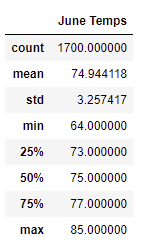
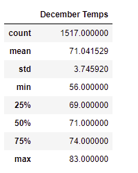

# surfs_up

## Overview of the analysis: 	

- The report aims to examine the temperature trends with the purpose of open a surf and ice cream shops. The report focuses on the data on June and December to analyze the sustainability of these shops

## Results: Provide a bulleted list with three major points from the two analysis deliverables. Use images as support where needed.

-	The mean/average: June ( approximately 74) is higher than December (approximately 71). June is hotter than December.
-	The std : of June (3.2574) is lower than in December (3.7459). Temperature is spread in December more than June. 
-	The min and max: June (min: 64 and max: 85) has smaller gap than December (min: 56 and max: 83). 

## Summary: 

- Based on the data, the owner should start running this business.

- We can check the precipitation of each month by using these two queries: 

-- results = session.query(Measurement.date, Measurement.prcp).filter(Measurement.date == 6).all()
-- results = session.query(Measurement.date, Measurement.prcp).filter(Measurement.date == 12).all()
